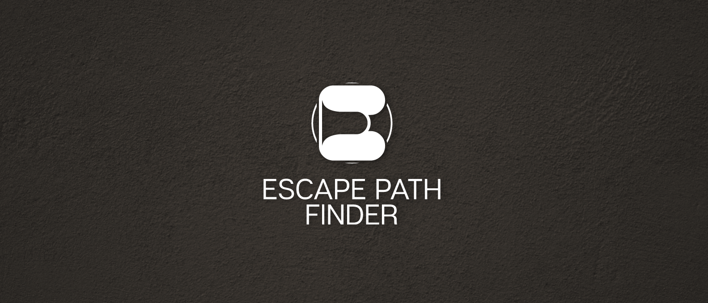

# EscapePathFinder

## About EscapePathFinder
Hello and welcome to EscapePathFinder. EscapePathFinder is a web platform designed to provide personalized escape routes during natural disasters. Our goal is to enhance the safety and preparedness of communities in disaster-prone areas by providing a user-friendly and reliable tool for emergency escape planning.
## The Problem
In the face of increasing natural disasters, individuals often lack accessible and personalized resources to efficiently plan and execute escape routes. Current emergency response systems may not provide real-time, location-specific information, leaving people vulnerable and unprepared during critical situations. There is a pressing need for a comprehensive solution that empowers individuals with personalized escape routes based on their specific location, ensuring timely and effective evacuation strategies tailored to the dynamic nature of natural disasters.
## The Solution
**EscapePathFinder** is a web platform designed to address the challenges posed by natural disasters. By leveraging artificial intelligence, sattelite-, gps- and real-time-data, the platform generates personalized escape routes for individuals. Users in emergency situations will recive a text message where they can generate a personilzed escape route.
## Key Features
- **Personalized Escape Routes:**
  - Generate customized evacuation plans based on real-time conditions.
  - 
- **User-Friendly Interface:**
  - Intuitive design for easy navigation and quick access to critical information.

## 🚀 Getting Started
**How it works**
1. **Installation:**
   - No installation required. Access the platform through [EscapePathFinder.com](https://www.figma.com/proto/YgMZCOct0g5RMm4Q3lU0IZ/Prototype-2?type=design&node-id=25-491&t=0wOM1V8xzpxSHY39-0&scaling=scale-down&page-id=0%3A1&starting-point-node-id=25%3A491).
2. **Usage:**
   - Allow the website to use your location.
   - Klick on Generate Route to receive your personilized escape route.
  
Try our prototype yourself [here](https://www.figma.com/proto/YgMZCOct0g5RMm4Q3lU0IZ/Prototype-2?type=design&node-id=8-109&t=0wOM1V8xzpxSHY39-0&scaling=scale-down&page-id=0%3A1).

## 🌐 Our GitHub Page
You can access our GitHub page [here](https://real-projects-digitalization.github.io/ss22-gpteam/).
## 📝 Documentation
You can access our GitHub Wiki for detailed documentation [here](https://github.com/Real-Projects-Digitalization/ss22-gpteam/wiki).

## Thank you for choosing EscapePathFinder! Your safety is our priority.
